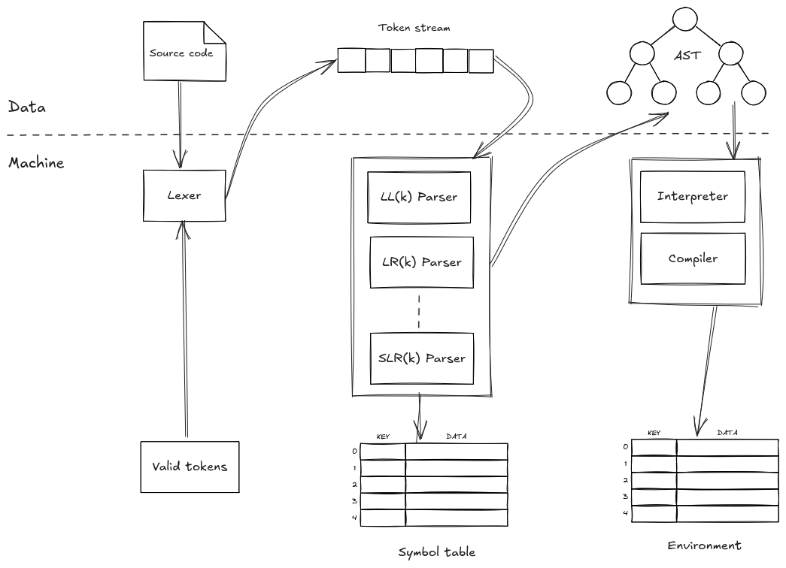
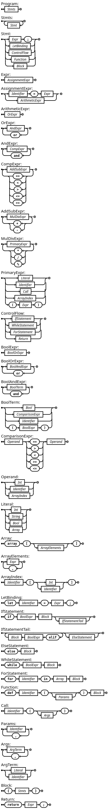
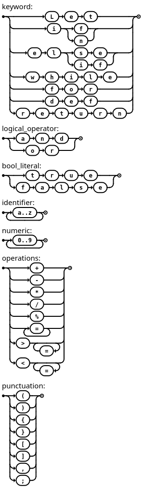

### Design Diagram



### Grammar Specific Features

| **Feature**          | **Description**                                                                    |
| -------------------- | ---------------------------------------------------------------------------------- |
| `bool`               | Represents a boolean value (`true` or `false`).                                    |
| `int`                | Represents integer numeric values.                                                 |
| `string`             | Represents text data enclosed in double quotes (`"..."`).                          |
| `array[]`            | A list of elements, all of the same type, defined using square brackets.           |
| **Variable Scoping** | Variables have local scope—within functions or blocks—ensuring clean lifetimes.    |
| `if-else`            | Conditional branching: executes a block if a condition is true, otherwise another. |
| `while` loop         | Repeats a block as long as a condition evaluates to true.                          |
| `for` loop           | Iterates over an array, binding each item to a loop variable.                      |
| **Functions**        | Named blocks of code with parameters, reusable and optionally returning values.    |

### Grammatically Valid Statements

#### Arithmeric

```
1 + 5 - 2 * 2;
```

#### Boolean

```
true == true
true != true
true and false
true or false
```

#### String

```
"Hello world!";
```

#### Variables (Binding)

```
let a = 1 + 5;
let b = 2;
b = b + a; // 8
```

#### Arrays

```
array[1, 2, 3, 4];
```

```
let z = array[1, 2, 3, 4];
z[2]; // 3
```

#### If-statement

```
let a = 1;
let b = 0;

// Variant (1)
if a > b {
    b = 1;
} else {
    b = 2;
}
b; // 1
```
```
// Variant (2)
if a > b {
    b = 1;
}
b; // 1
```

```
// Variant (3)
if a == b {
    b = 1;
} elif a > b {
    b = 2;
}
b; // 2
```

#### While-loop-statement

```
let a = 0;

while a < 5 {
    a = a + 1;
}
a; // 5
```

#### For-loop-statement

```
let acc = 0;
let arr = array[2, 1, 3, 7];

for v in arr {
    acc = acc + v;
}
acc; // 13
```

#### User-defined functions

```
def max(a, b) {
    if a > b {
        return a;
    } else {
        return b;
    }
}
max(7, 12); // 12
```

#### Builtin functions

| Function name | Signature       | Description                         |
| ------------- | --------------- | ----------------------------------- |
| print         | `print(<args>)` | Prints all arguments to the console |
| max           | `max(a, b)`     | Returns the maximum of two integers |
| min           | `min(a, b)`     | Returns the minimum of two integers |

### LL(k) Grammar

An **LL(k) grammar** is a type of context-free grammar that can be parsed from 
left to right, constructing a leftmost derivation of the input string using at 
most **k tokens of lookahead**. The name "LL(k)" comes from this parsing 
strategy: the first "L" stands for scanning the input from **Left to right**, 
the second "L" stands for producing a **Leftmost derivation**, and "k" 
represents the number of lookahead tokens used to guide parsing decisions. 

LL(k) grammars are particularly important because they allow for **predictive** 
**parsing**, where the parser can choose which rule to apply based on a fixed 
number of upcoming tokens, without requiring backtracking or guessing. LL(1) 
grammars, where only one token of lookahead is needed, are the most common and 
desirable subclass, often used in recursive descent parsers. 

However, not all grammars are LL(1); some may require more lookahead to resolve
ambiguities, making them LL(k) for higher values of k. If a grammar is not LL(k) 
for any finite k, it typically cannot be parsed top-down without extra techniqu-
es like backtracking or left-factoring. Compared to bottom-up parsers (like LR -
parsers), LL parsers are simpler but more limited in the class of languages they 
can handle.

#### Whisp Grammar Construction

For the grammar notation we will be using [BNF notation](https://en.wikipedia.org/wiki/Backus%E2%80%93Naur_form)

##### Precedence

| Precedence | Operators                       |
| ---------: | ------------------------------- |
|          1 | `[]` (array indexing), literals |
|          2 | `* / %`                         |
|          3 | `+ -`                           |
|          4 | Comparison: `== < > <= >=`      |
|          5 | Logical AND: `and`              |
|          6 | Logical OR: `or`                |
|          7 | Assignment: `=`                 |


Let's look at the following expression and see why precedence matters.

**Expression 1**

```
1 + 2
```

```
    +
   / \
  1   2
```

**Expression 2**
```
1 + 2 * 3
```
Without precedence, the expression evaluates to `9` which is clearly wrong to a 
smart individual.

```
      *
     / \
    +   3
   / \
  1   2
```

With precedence, the expression evaluates to `7` which is correct.

Explanation:

  - consume operand `1` into a operand stack, advance to the next token,
  - consume operation `+` into a operation stack, and advance,
  - consume operand `2` into a stack, advance,
  - consume operation `*`, since it has high precedence than `+` push into stack,
  - comsume operand `3` into stack.
  - pop operation from operation stack, `*` and pop two operands from stack,
  - construct a node and push into operand stack, `(2 3 *)`,
  - repeat the process andyou'll end up with the following results,

```
1 2 3 * +
```

```
      +
     / \
    1   *
       / \
      2   3
```

The now is how can we create a grammar that does not necessary have to make use 
of a stack to construct an AST? The answer is actually infront of our eyes: 
**simply evaluate this expression `1 2 3 * +` backwards**. Doing so, we would
get the following grammar:

```
Expr      ::= AddExpr

AddExpr   ::= MulExpr AddExpr'
AddExpr'  ::= '+' MulExpr | ε

MulExpr   ::= Int MulExpr'
MulExpr'  ::= '*' Int MulExpr' | ε
```

##### LL(k) Grammar

```
Program           ::= Stmts

Stmts             ::= Stmt Stmts
                    | ε

Stmt              ::= Expr ';'
                    | LetBinding
                    | ControlFlow
                    | Function
                    | Block

Expr              ::= AssignExpr

AssignExpr        ::= OrExpr AssignExprTail
AssignExprTail    ::= '=' Expr
                    | ε

OrExpr            ::= AndExpr OrExprTail
OrExprTail        ::= 'or' AndExpr OrExprTail
                    | ε

AndExpr           ::= CompExpr AndExprTail
AndExprTail       ::= 'and' CompExpr AndExprTail
                    | ε

CompExpr          ::= AddSubExpr CompExprTail
CompExprTail      ::= ('==' | '<' | '>' | '<=' | '>=') AddSubExpr CompExprTail
                    | ε

AddSubExpr        ::= MulDivExpr AddSubExprTail
AddSubExprTail    ::= ('+' | '-') MulDivExpr AddSubExprTail
                    | ε

MulDivExpr        ::= PrimaryExpr MulDivExprTail
MulDivExprTail    ::= ('*' | '/' | '%') PrimaryExpr MulDivExprTail
                    | ε

PrimaryExpr       ::= Literal
                    | Identifier
                    | Call
                    | ArrayIndex
                    | '(' Expr ')'

ControlFlow       ::= IfStatement
                    | WhileStatement
                    | ForStatement
                    | Return

BoolExpr          ::= BoolOrExpr

BoolOrExpr        ::= BoolAndExpr BoolOrExprTail
BoolOrExprTail   ::= 'or' BoolAndExpr BoolOrExprTail
                    | ε

BoolAndExpr       ::= BoolTerm BoolAndExprTail
BoolAndExprTail   ::= 'and' BoolTerm BoolAndExprTail
                    | ε

BoolTerm          ::= Bool
                    | ComparisonExpr
                    | Identifier
                    | '(' BoolExpr ')'

ComparisonExpr    ::= Operand ('==' | '>' | '<' | '>=' | '<=') Operand

Operand           ::= Int
                    | Identifier
                    | ArrayIndex

Literal           ::= Int
                    | String
                    | Bool
                    | Array

Array             ::= 'array' '[' ArrayElements ']'
ArrayElements     ::= Expr ArrayElementsTail
                    | ε
ArrayElementsTail ::= ',' Expr ArrayElementsTail
                    | ε

ArrayIndex        ::= Identifier '[' (Int | Identifier) ']'

LetBinding        ::= 'let' Identifier '=' Expr ';'

IfStatement       ::= 'if' BoolExpr Block IfStatementTail

IfStatementTail   ::= 'elif' BoolExpr Block IfStatementTail
                    | ElseStatement
                    | ε

ElseStatement     ::= 'else' Block

WhileStatement    ::= 'while' BoolExpr Block

ForStatement      ::= 'for' Identifier 'in' Array Block

Function          ::= 'def' Identifier '(' Params ')' Block

Call              ::= Identifier '(' Args ')'

Params            ::= Identifier ParamsTail
                    | ε

ParamsTail       ::= ',' Identifier ParamsTail
                    | ε

Args              ::= ArgTerm ArgsTail
                    | ε
ArgsTail          ::= ',' ArgTerm ArgsTail
                    | ε

ArgTerm           ::= Literal
                    | Identifier

Block             ::= '{' Stmts '}'

Return            ::= 'return' Expr ';'

terminal Int;
terminal Bool;
terminal String;
terminal Identifier;
```

##### Visual Representation

Visual representation of the grammar was generated with [DrawGrammar](https://jacquev6.github.io/DrawGrammar/) 



### Token Summary

#### Keywords

| Token Variant | Symbol   | Description          |
| ------------- | -------- | -------------------- |
| `Let`         | `let`    | Variable declaration |
| `If`          | `if`     | Conditional start    |
| `Elif`        | `elif`   | Else-if condition    |
| `Else`        | `else`   | Else block           |
| `While`       | `while`  | While loop           |
| `For`         | `for`    | For loop             |
| `In`          | `in`     | Membership operator  |
| `Def`         | `def`    | Function definition  |
| `Return`      | `return` | Return from function |

#### Literals & Identifiers

| Token Variant        | Example        | Description               |
| -------------------- | -------------- | ------------------------- |
| `Identifier(String)` | `"x"`          | Variable or function name |
| `Int(i32)`           | `42`           | Integer literal           |
| `Bool(bool)`         | `true`/`false` | Boolean literal           |
| `String(String)`     | `"hello"`      | String literal            |

#### Arithmetic Operators

| Token Variant | Symbol | Description    |
| ------------- | ------ | -------------- |
| `Plus`        | `+`    | Addition       |
| `Minus`       | `-`    | Subtraction    |
| `Mul`         | `*`    | Multiplication |
| `Div`         | `/`    | Division       |
| `Mod`         | `%`    | Modulo         |

#### Assignment & Comparison

| Token Variant  | Symbol | Description           |
| -------------- | ------ | --------------------- |
| `Assign`       | `=`    | Assignment            |
| `Equal`        | `==`   | Equality check        |
| `GreaterThan`  | `>`    | Greater than          |
| `LessThan`     | `<`    | Less than             |
| `GreaterEqual` | `>=`   | Greater than or equal |
| `LessEqual`    | `<=`   | Less than or equal    |

#### Logical Operators

| Token Variant | Symbol | Description |
| ------------- | ------ | ----------- |
| `And`         | `and`  | Logical AND |
| `Or`          | `or`   | Logical OR  |

#### Punctuation

| Token Variant | Symbol | Description       |
| ------------- | ------ | ----------------- |
| `LParen`      | `(`    | Left parenthesis  |
| `RParen`      | `)`    | Right parenthesis |
| `LBrace`      | `{`    | Left brace        |
| `RBrace`      | `}`    | Right brace       |
| `LBracket`    | `[`    | Left bracket      |
| `RBracket`    | `]`    | Right bracket     |
| `Comma`       | `,`    | Comma             |
| `Semicolon`   | `;`    | Semicolon         |

### Token Finite State Machine



## Modules

Sometmes when your code gets big enough, you'd want to break it into smaller 
pieces of code that are manageable and reusable, which brings us to modules. So,
Whisp needs a way to know how to handle registration and loading of modules just
any interpreted or compiled language.


```
project_root/
├── src/
│   ├── folder1/
│   │   ├── show.w
│   │   ├── greet.w
│   │   └── folder2/
│   │       └── hello.w
│   └── yelo.w
```

Syntax for importing modules

```
import yelo;
import folder1::{ show, greet };
import folder1::folder2::hello;
```

#### Whisp Module System Requirements

Inspired by the Python module system, the Whisp module system should be able to:

| Functionality          | Description                                             |
| ---------------------- | ------------------------------------------------------- |
| **Browse directories** | Discover valid `.w` files for possible imports          |
| **Load a module**      | Parse and store the AST of a module file                |
| **Register a module**  | Store it in a `ModuleRegistry` to avoid reloading       |
| **Execute a module**   | Evaluate the module's top-level code and expose exports |


#### Module System Workflow

>Inspired by Python module system.


